# Result-Management-System
##### Download APK File : [Click here](https://drive.google.com/file/d/17Fq8Fzg9_AdVm4p5YI3m5Umu6ijxO6vB/view?usp=sharing)

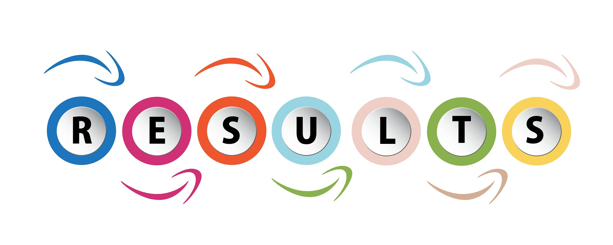

## Topics :

   1. [Project Details](#Project-Details)
   2. [Purpose](#Purpose)
   3. [Scope](#Scope)
   4. [Project Introduction](#Project-Introduction)
      * Existing-System
      * Proposed-System
   5. [Some Screen Pics](#Screen)

## Project Details:

   * @Author : `Dwarka prasad Bairwa(1801061)`  , `Amar Kumar(1801016)` , `Deepak Kumar Yadav (1801048)`
   
   * Project Name : `Result Management System`

   * Requirements :
   
    1. Database Server : Firebase
    2. Client : Android/i-OS
    3. Development Tools : Android Studio , VS Code
    4. Programming Language : Dart
    5. SDK : Flutter

   * Project Directory Structure : 
   
       * 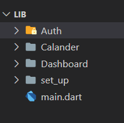 
       
       * 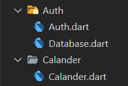
       
       * 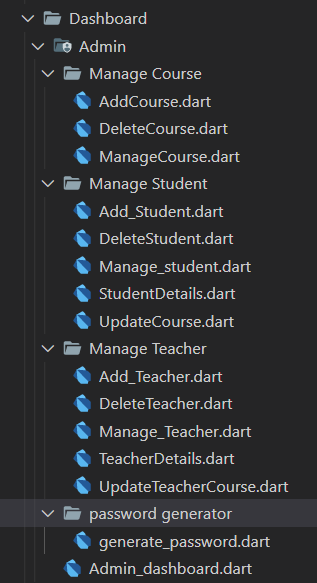
       
       * 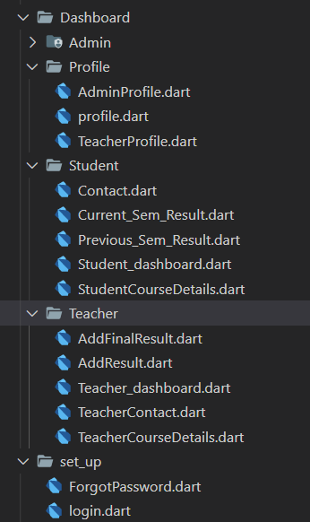
    
   * Project Dependecies : 
   
       * 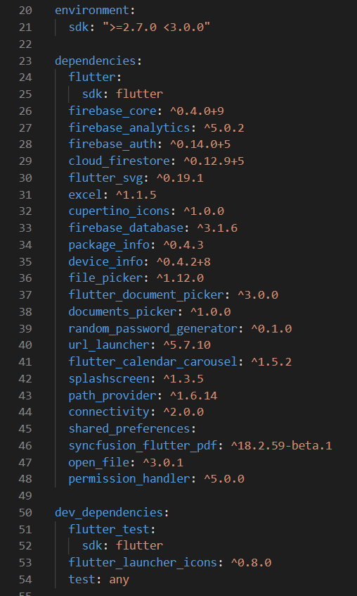

   * Resources : [Mannual Testing](https://drive.google.com/drive/folders/1HSWuKgS8gAP8CKuOxwLveP8rEYzMmJq3) , [APK File](https://drive.google.com/file/d/17Fq8Fzg9_AdVm4p5YI3m5Umu6ijxO6vB/view?usp=sharing), [Report File](Report.pdf)


   
## Purpose

   ```
   The purpose of developing this “Result Management System” is to automate student
   result management. This application will greatly simplify and speed up the result
   preparation and management process.The application will manage the information about
   various students enrolled in this course in different years, the marks obtained by the
   various students in various subjects in different semesters. 
   
   ```

## Scope

  ```
  The application will manage the information about various students enrolled in this
course in different years, the subjects offered during different semesters, and the various
students' marks in multiple subjects in different semesters.The application will greatly
simplify and speed up the result preparation and management process.
  ```

## Project-Introduction

   * Existing-System
   ```
   The manual method of students’ academic result processing was found to be tedious,
   especially when carried out for a large number of students, this makes the entire process
   time-consuming and error prone.
   
   A existing system has following disadvantages:
   
➢ In the manual system students need to bear a lot of time and cost.
➢ Compiling the result in the manual system is a tedious process.
➢ Lack of transparency in the present system.
➢ In the existing system, students have no proper idea of marks in different
   assessments for their self-evaluation. Learning from mistakes is the best way
   for the growth of a student.   
➢ Existing System creates more pressure on the examination board of the college.
```
      
   * Proposed-System
   ```
   The system presents a single platform that will be used to manage the processing of all
   examination records within the institution. Admin gives the privileges to the Teacher to
   1update/add the student’s result of the respective course.
   
➢ Student Registration: Admin can register a student.
➢ Faculty Registration: Admin can register a faculty.
➢ Result: Students can get the Updated result of all the exams (quiz,viva,mid
   semester and end semester) via this Application.   
➢ Authentication: Admin will send secure login credentials to all students & faculty
   using a python script.   
➢ Marks of all internal assessments: Students are able to view their marks of quiz,
   viva, projects, mid-sem,end-sem,lab assignments etc. for self evaluation.  
➢ Administration Access: The administration has all the privileges to add/update any
   details about students & faculty.
   
   ```
    
## Screen
 * Login/Forgot Password/calender Screen
 
   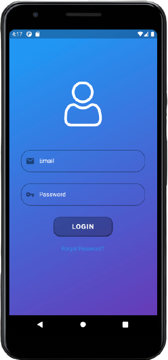</img>
   </img>

 * Student
 
   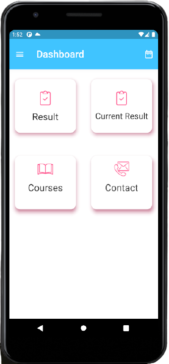</img>
   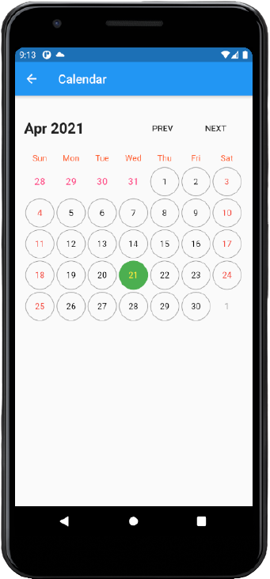</img>

   
 * Faculty

   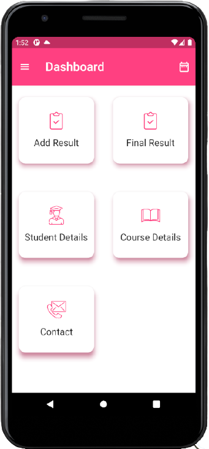</img>
   </img>
   
 * Admin
 
   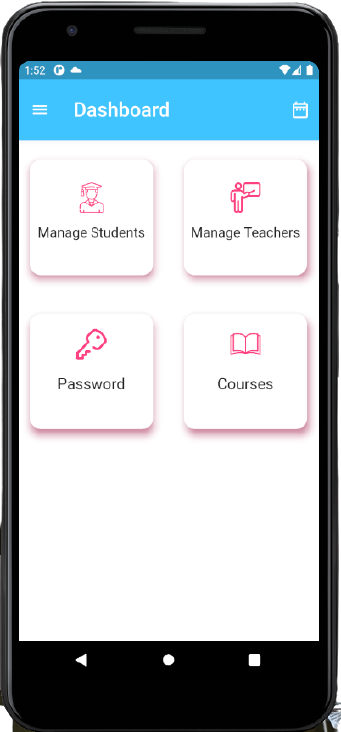</img>
   </img>


 

#### See Full Report : [here](Report.pdf)

   
   

