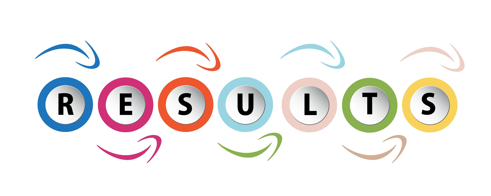

# Result-Management-System

## __Purpose__

## __Project__

  * __Screens__
  
    * Login Screen
  
      Login</img>
      Login Alert</img>
      
    * Forgot Password
    
      Login</img>
      Login Alert</img>
      Login Invalid Alert</img>

    

